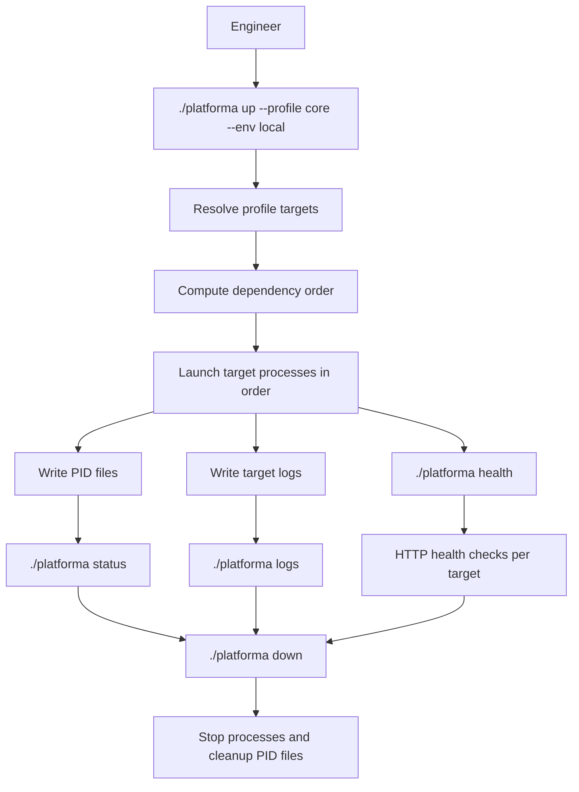
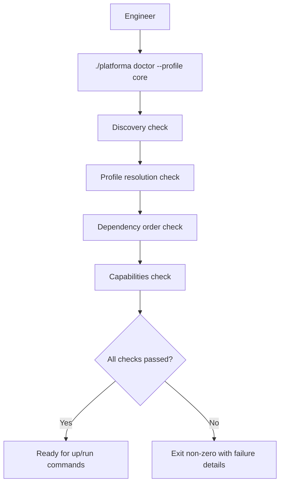
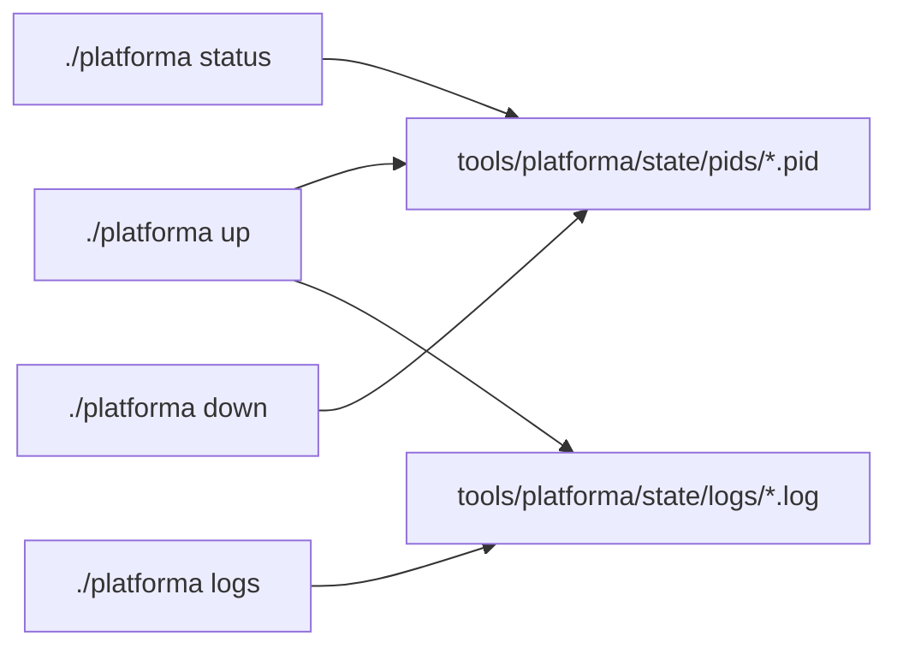

# Script System Diagrams

This document captures local orchestration and preflight behavior for
`./platforma`.

## Local Orchestration Lifecycle

## Doctor Preflight Flow

## Runtime State Layout

